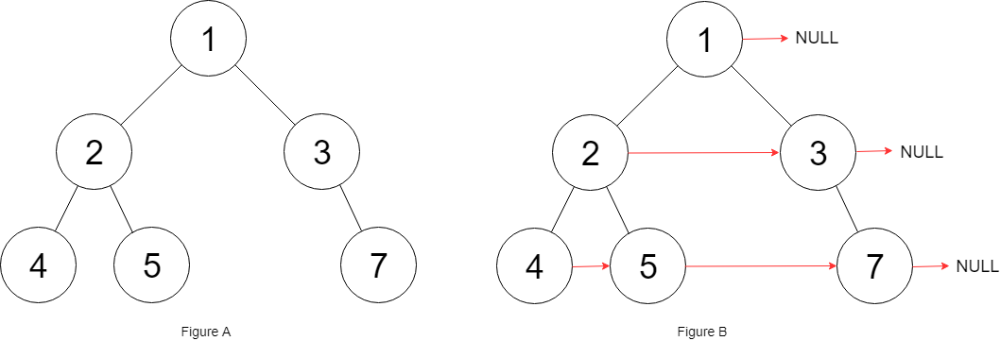

# 117. Populating Next Right Pointers in Each Node II - LeetCode Python/Java/C++/JS/C#/Go/Ruby Solutions

> [**Build Your Programmer Brand at leader.me →**](https://www.leader.me)

Visit original link: [117. Populating Next Right Pointers in Each Node II - LeetCode Python/Java/C++/JS/C#/Go/Ruby Solutions](https://www.leader.me/leetcode/en/solutions/117-populating-next-right-pointers-in-each-node-ii) for a better experience!

LeetCode link: [117. Populating Next Right Pointers in Each Node II](https://leetcode.com/problems/populating-next-right-pointers-in-each-node-ii), difficulty: **Medium**.

## LeetCode description of "117. Populating Next Right Pointers in Each Node II"

Given a binary tree:

```
struct Node {
  int val;
  Node *left;
  Node *right;
  Node *next;
}
```

Populate each next pointer to point to its next right node. If there is no next right node, the next pointer should be set to `NULL`.

Initially, all next pointers are set to `NULL`.

### [Example 1]



**Input**: `root = [1,2,3,4,5,null,7]`

**Output**: `[1,#,2,3,#,4,5,7,#]`

**Explanation**: 

<p>Given the above binary tree (Figure A), your function should populate each next pointer to point to its next right node, just like in Figure B. The serialized output is in level order as connected by the next pointers, with &#39;#&#39; signifying the end of each level.</p>


### [Example 2]

**Input**: `root = []`

**Output**: `[]`

### [Constraints]

* The number of nodes in the tree is in the range `[0, 6000]`.
* `-100 <= Node.val <= 100`

## Intuition

We need to connect nodes at the same level. A standard Breadth-First Search (BFS) using a queue takes O(N) space. However, the problem asks for O(1) extra space. Notice that once a level's `next` pointers are fully connected, it forms a linked list. We can traverse the current level as a linked list to find all children and link them up to form the next level's linked list. By using a dummy node for the next level, we can easily keep track of the start of the next level.

## Step-by-Step Solution

1. Initialize a pointer `head` to the `root` of the tree. This represents the start of the current level.
2. Loop while `head` is not null:
   - Create a `dummy` node to serve as the head of the next level's linked list.
   - Use a `tail` pointer, initially pointing to `dummy`, to append child nodes.
   - Traverse the current level using the `next` pointers:
     - If `head.left` exists, append it to `tail.next` and move `tail` forward.
     - If `head.right` exists, append it to `tail.next` and move `tail` forward.
     - Move `head` to its `next` node in the current level.
   - Move `head` to `dummy.next`, which is the start of the newly constructed next level.
3. Return the original `root`.

## Complexity

> - **Time Complexity**: `O(N)`. We visit every node in the binary tree exactly once.
- **Space Complexity**: `O(1)`. We only use a few extra pointers (`head`, `dummy`, `tail`) for the level traversal, avoiding the `O(N)` space overhead of a queue. Implicit stack space is not used since this is an iterative approach.

- Time complexity: `O(N)`.
- Space complexity: `O(1)`.

## Python

```python
"""
# Definition for a Node.
class Node:
    def __init__(self, val: int = 0, left: 'Node' = None, right: 'Node' = None, next: 'Node' = None):
        self.val = val
        self.left = left
        self.right = right
        self.next = next
"""

class Solution:
    def connect(self, root: 'Node') -> 'Node':
        # Start with the root node as the head of the current level
        head = root
        
        while head:
            # Create a dummy node to act as the head of the next level's linked list
            dummy = Node(0)
            # Tail pointer to append children to the next level
            tail = dummy
            
            # Traverse the current level
            while head:
                # If there is a left child, append it to the next level's list
                if head.left:
                    tail.next = head.left
                    tail = tail.next
                
                # If there is a right child, append it to the next level's list
                if head.right:
                    tail.next = head.right
                    tail = tail.next
                
                # Move to the next node in the current level
                head = head.next
            
            # Move down to the next level
            head = dummy.next
            
        return root
```

## Java

```java
/*
// Definition for a Node.
class Node {
    public int val;
    public Node left;
    public Node right;
    public Node next;

    public Node() {}
    
    public Node(int _val) {
        val = _val;
    }

    public Node(int _val, Node _left, Node _right, Node _next) {
        val = _val;
        left = _left;
        right = _right;
        next = _next;
    }
};
*/

class Solution {
    public Node connect(Node root) {
        // Start with the root node as the head of the current level
        Node head = root;
        
        while (head != null) {
            // Dummy node to track the start of the next level
            Node dummy = new Node(0);
            // Tail pointer to append nodes to the next level
            Node tail = dummy;
            
            // Traverse the current level
            while (head != null) {
                // If the left child exists, link it
                if (head.left != null) {
                    tail.next = head.left;
                    tail = tail.next;
                }
                
                // If the right child exists, link it
                if (head.right != null) {
                    tail.next = head.right;
                    tail = tail.next;
                }
                
                // Move to the next node in the current level
                head = head.next;
            }
            
            // Move to the next level (the first node after dummy)
            head = dummy.next;
        }
        
        return root;
    }
}
```

## JavaScript

```javascript
/**
 * // Definition for a _Node.
 * function _Node(val, left, right, next) {
 *    this.val = val === undefined ? null : val;
 *    this.left = left === undefined ? null : left;
 *    this.right = right === undefined ? null : right;
 *    this.next = next === undefined ? null : next;
 * };
 */

/**
 * @param {_Node} root
 * @return {_Node}
 */
var connect = function(root) {
    // Start with the root node as the head of the current level
    let head = root;
    
    while (head !== null) {
        // Dummy node to track the start of the next level
        let dummy = new _Node(0);
        // Tail pointer to append nodes to the next level
        let tail = dummy;
        
        // Traverse the current level
        while (head !== null) {
            // If the left child exists, link it
            if (head.left !== null) {
                tail.next = head.left;
                tail = tail.next;
            }
            
            // If the right child exists, link it
            if (head.right !== null) {
                tail.next = head.right;
                tail = tail.next;
            }
            
            // Move to the next node in the current level
            head = head.next;
        }
        
        // Move to the next level (the first node after dummy)
        head = dummy.next;
    }
    
    return root;
};
```

## Cpp

```cpp
/*
// Definition for a Node.
class Node {
public:
    int val;
    Node* left;
    Node* right;
    Node* next;

    Node() : val(0), left(NULL), right(NULL), next(NULL) {}

    Node(int _val) : val(_val), left(NULL), right(NULL), next(NULL) {}

    Node(int _val, Node* _left, Node* _right, Node* _next)
        : val(_val), left(_left), right(_right), next(_next) {}
};
*/

class Solution {
public:
    Node* connect(Node* root) {
        // Start with the root node as the head of the current level
        Node* head = root;
        
        while (head != nullptr) {
            // Dummy node to track the start of the next level
            Node* dummy = new Node(0);
            // Tail pointer to append nodes to the next level
            Node* tail = dummy;
            
            // Traverse the current level
            while (head != nullptr) {
                // If the left child exists, link it
                if (head->left != nullptr) {
                    tail->next = head->left;
                    tail = tail->next;
                }
                
                // If the right child exists, link it
                if (head->right != nullptr) {
                    tail->next = head->right;
                    tail = tail->next;
                }
                
                // Move to the next node in the current level
                head = head->next;
            }
            
            // Move to the next level (the first node after dummy)
            head = dummy->next;
            // Prevent memory leak
            delete dummy;
        }
        
        return root;
    }
};
```

## Csharp

```csharp
/*
// Definition for a Node.
public class Node {
    public int val;
    public Node left;
    public Node right;
    public Node next;

    public Node() {}

    public Node(int _val) {
        val = _val;
    }

    public Node(int _val, Node _left, Node _right, Node _next) {
        val = _val;
        left = _left;
        right = _right;
        next = _next;
    }
}
*/

public class Solution {
    public Node Connect(Node root) {
        // Start with the root node as the head of the current level
        Node head = root;
        
        while (head != null) {
            // Dummy node to track the start of the next level
            Node dummy = new Node();
            // Tail pointer to append nodes to the next level
            Node tail = dummy;
            
            // Traverse the current level
            while (head != null) {
                // If the left child exists, link it
                if (head.left != null) {
                    tail.next = head.left;
                    tail = tail.next;
                }
                
                // If the right child exists, link it
                if (head.right != null) {
                    tail.next = head.right;
                    tail = tail.next;
                }
                
                // Move to the next node in the current level
                head = head.next;
            }
            
            // Move to the next level (the first node after dummy)
            head = dummy.next;
        }
        
        return root;
    }
}
```

## Go

```go
/**
 * Definition for a Node.
 * type Node struct {
 *     Val int
 *     Left *Node
 *     Right *Node
 *     Next *Node
 * }
 */

func connect(root *Node) *Node {
    // Start with the root node as the head of the current level
    head := root
    
    for head != nil {
        // Dummy node to track the start of the next level
        dummy := &Node{}
        // Tail pointer to append nodes to the next level
        tail := dummy
        
        // Traverse the current level
        for head != nil {
            // If the left child exists, link it
            if head.Left != nil {
                tail.Next = head.Left
                tail = tail.Next
            }
            
            // If the right child exists, link it
            if head.Right != nil {
                tail.Next = head.Right
                tail = tail.Next
            }
            
            // Move to the next node in the current level
            head = head.Next
        }
        
        // Move to the next level (the first node after dummy)
        head = dummy.Next
    }
    
    return root
}
```

## Ruby

```ruby
# Definition for Node.
# class Node
#     attr_accessor :val, :left, :right, :next
#     def initialize(val)
#         @val = val
#         @left, @right, @next = nil, nil, nil
#     end
# end

# @param {Node} root
# @return {Node}
def connect(root)
    # Start with the root node as the head of the current level
    head = root
    
    while head
        # Dummy node to track the start of the next level
        dummy = Node.new(0)
        # Tail pointer to append nodes to the next level
        tail = dummy
        
        # Traverse the current level
        while head
            # If the left child exists, link it
            if head.left
                tail.next = head.left
                tail = tail.next
            end
            
            # If the right child exists, link it
            if head.right
                tail.next = head.right
                tail = tail.next
            end
            
            # Move to the next node in the current level
            head = head.next
        end
        
        # Move to the next level (the first node after dummy)
        head = dummy.next
    end
    
    root
end
```

## Rust

```rust
// Note: LeetCode does not officially support Rust for TreeLinkNode problems with mutable 'next' pointers easily.
// This is a conceptual implementation using typical interior mutability patterns in Rust.
use std::rc::Rc;
use std::cell::RefCell;

// Definition for a Node.
#[derive(Debug, PartialEq, Eq)]
pub struct Node {
    pub val: i32,
    pub left: Option<Rc<RefCell<Node>>>,
    pub right: Option<Rc<RefCell<Node>>>,
    pub next: Option<Rc<RefCell<Node>>>,
}

impl Node {
    #[inline]
    pub fn new(val: i32) -> Self {
        Node {
            val,
            left: None,
            right: None,
            next: None,
        }
    }
}

pub struct Solution;

impl Solution {
    pub fn connect(root: Option<Rc<RefCell<Node>>>) -> Option<Rc<RefCell<Node>>> {
        if root.is_none() {
            return None;
        }

        // Start with the root node as the head of the current level
        let mut head = root.clone();

        while let Some(current_head) = head {
            // Dummy node to track the start of the next level
            let dummy = Rc::new(RefCell::new(Node::new(0)));
            let mut tail = dummy.clone();
            
            let mut current = Some(current_head);

            // Traverse the current level
            while let Some(node_rc) = current {
                let node = node_rc.borrow();

                // If the left child exists, link it
                if let Some(left) = node.left.clone() {
                    tail.borrow_mut().next = Some(left.clone());
                    tail = left;
                }

                // If the right child exists, link it
                if let Some(right) = node.right.clone() {
                    tail.borrow_mut().next = Some(right.clone());
                    tail = right;
                }

                // Move to the next node in the current level
                current = node.next.clone();
            }

            // Move to the next level (the first node after dummy)
            head = dummy.borrow().next.clone();
        }

        root
    }
}
```

## Kotlin

```kotlin
/**
 * Definition for a Node.
 * class Node(var `val`: Int) {
 *     var left: Node? = null
 *     var right: Node? = null
 *     var next: Node? = null
 * }
 */

class Solution {
    fun connect(root: Node?): Node? {
        // Start with the root node as the head of the current level
        var head = root
        
        while (head != null) {
            // Dummy node to track the start of the next level
            val dummy = Node(0)
            // Tail pointer to append nodes to the next level
            var tail: Node? = dummy
            
            // Traverse the current level
            while (head != null) {
                // If the left child exists, link it
                if (head.left != null) {
                    tail?.next = head.left
                    tail = tail?.next
                }
                
                // If the right child exists, link it
                if (head.right != null) {
                    tail?.next = head.right
                    tail = tail?.next
                }
                
                // Move to the next node in the current level
                head = head.next
            }
            
            // Move to the next level (the first node after dummy)
            head = dummy.next
        }
        
        return root
    }
}
```

## Swift

```swift
/**
 * Definition for a Node.
 * public class Node {
 *     public var val: Int
 *     public var left: Node?
 *     public var right: Node?
 *     public var next: Node?
 *     public init(_ val: Int) {
 *         self.val = val
 *         self.left = nil
 *         self.right = nil
 *         self.next = nil
 *     }
 * }
 */

class Solution {
    func connect(_ root: Node?) -> Node? {
        // Start with the root node as the head of the current level
        var head = root
        
        while head != nil {
            // Dummy node to track the start of the next level
            let dummy = Node(0)
            // Tail pointer to append nodes to the next level
            var tail: Node? = dummy
            
            // Traverse the current level
            while head != nil {
                // If the left child exists, link it
                if let left = head?.left {
                    tail?.next = left
                    tail = tail?.next
                }
                
                // If the right child exists, link it
                if let right = head?.right {
                    tail?.next = right
                    tail = tail?.next
                }
                
                // Move to the next node in the current level
                head = head?.next
            }
            
            // Move to the next level (the first node after dummy)
            head = dummy.next
        }
        
        return root
    }
}
```

## Other languages

```java
// Welcome to create a PR to complete the code of this language, thanks!
```

> 🚀 **Level Up Your Developer Identity**
>
> While mastering algorithms is key, showcasing your talent is what gets you hired.
>
> We recommend [**leader.me**](https://www.leader.me) — the ultimate all-in-one personal branding platform for programmers.
>
> **The All-In-One Career Powerhouse:**
> - 📄 **Resume, Portfolio & Blog:** Integrate your skills, GitHub projects, and writing into one stunning site.
> - 🌐 **Free Custom Domain:** Bind your own personal domain for free—forever.
> - ✨ **Premium Subdomains:** Stand out with elite tech handle like `name.leader.me`.
>
> [**Build Your Programmer Brand at leader.me →**](https://www.leader.me)

---

Visit original link: [117. Populating Next Right Pointers in Each Node II - LeetCode Python/Java/C++/JS/C#/Go/Ruby Solutions](https://www.leader.me/leetcode/en/solutions/117-populating-next-right-pointers-in-each-node-ii) for a better experience!

GitHub repository: [leetcode-python-java](https://github.com/leetcode-python-java/leetcode-python-java).

