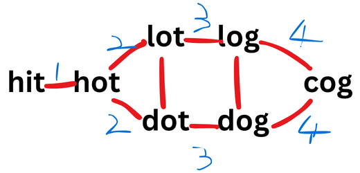

# LeetCode 127. Word Ladder's Solution
LeetCode link: [127. Word Ladder](https://leetcode.com/problems/word-ladder/)

## LeetCode problem description
A **transformation sequence** from word `beginWord` to word `endWord` using a dictionary `wordList` is a sequence of words `beginWord -> s1 -> s2 -> ... -> sk` such that:

* Every adjacent pair of words differs by a single letter.
* Every `si` for `1 <= i <= k` is in `wordList`. Note that `beginWord` does not need to be in `wordList`.
* `sk == endWord`

Given two words, `beginWord` and `endWord`, and a dictionary `wordList`, return **the number of words** in the **shortest transformation sequence** from `beginWord` to `endWord`, or `0` if no such sequence exists.

### Example 1
```
Input: beginWord = "hit", endWord = "cog", wordList = ["hot","dot","dog","lot","log","cog"]
Output: 5
Explanation: One shortest transformation sequence is "hit" -> "hot" -> "dot" -> "dog" -> cog", which is 5 words long.
```

### Example 2
```
Input: beginWord = "hit", endWord = "cog", wordList = ["hot","dot","dog","lot","log"]
Output: 0
Explanation: The endWord "cog" is not in wordList, therefore there is no valid transformation sequence.
```

### Constraints
- `1 <= beginWord.length <= 10`
- `endWord.length == beginWord.length`
- `1 <= wordList.length <= 5000`
- `wordList[i].length == beginWord.length`
- `beginWord`, `endWord`, and `wordList[i]` consist of lowercase English letters.
- `beginWord != endWord`
- All the words in `wordList` are **unique**.

## Intuition
This problem is hard. Before solving this problem, you can do the following problem first:

- [200. Number of Islands (Solution 3: Breadth-First Search)](200-number-of-islands-3.md)

The **word transformation sequence** problem can be abstracted into a **graph theory** problem. And it is an **undirected graph**:



### Breadth-First Search


* As shown in the figure above, **breadth-first search** can be thought of as visiting vertices in rounds and rounds. Actually, whenever you see a question is about
getting `shortest` or `least` of something of a graph, `breadth-first search` would probably help.

* `breadth-first search` emphasizes first-in-first-out, so a **queue** is needed.

## Approach
1. `Breadth-First Search` a graph means traversing **from near to far**, from `circle 1` to `circle N`. Each `circle` is a round of iteration, but we can simplify it by using just 1 round.
1. So through `Breadth-First Search`, when a word matches `endWord`, the game is over, and we can return the number of **circle** as a result.

## Complexity
* Time: `O(n * n)`.
* Space: `O(n)`.

## Python
```python
class Solution:
    def __init__(self):
        self.word_set = None
        self.end_word = None
        self.queue = deque()

    def ladderLength(self, begin_word: str, end_word: str, word_list: List[str]) -> int:
        self.end_word = end_word
        self.word_set = set(word_list)

        if end_word not in self.word_set:
            return 0
        
        self.queue.append((begin_word, 1))

        return self.breadth_first_search()

    def breadth_first_search(self):
        while self.queue:
            word0, circle = self.queue.popleft()
            removed_words = set()

            for word in self.word_set:
                if one_char_different(word, word0):
                    if word == self.end_word:
                        return circle + 1

                    self.queue.append((word, circle + 1))

                    removed_words.add(word)
            
            self.word_set -= removed_words
        
        return 0


def one_char_different(word1, word2):
    different_char_count = 0

    for i in range(len(word1)):
        if word1[i] != word2[i]:
            different_char_count += 1
            if different_char_count > 1:
                return False
    
    return True
```

## Java
```java
// Welcome to create a PR to complete the code of this language, thanks!
```

## C++
```cpp
// Welcome to create a PR to complete the code of this language, thanks!
```

## JavaScript
```javascript
// Welcome to create a PR to complete the code of this language, thanks!
```

## C#
```c#
// Welcome to create a PR to complete the code of this language, thanks!
```

## Go
```go
// Welcome to create a PR to complete the code of this language, thanks!
```

## Ruby
```ruby
# Welcome to create a PR to complete the code of this language, thanks!
```

## C
```c
// Welcome to create a PR to complete the code of this language, thanks!
```

## Kotlin
```kotlin
// Welcome to create a PR to complete the code of this language, thanks!
```

## Swift
```swift
// Welcome to create a PR to complete the code of this language, thanks!
```

## Rust
```rust
// Welcome to create a PR to complete the code of this language, thanks!
```

## Other languages
```
// Welcome to create a PR to complete the code of this language, thanks!
```
