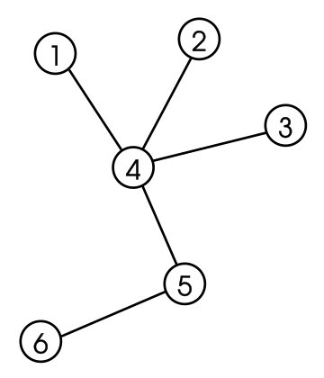

# LeetCode 684. Redundant Connection's Solution
LeetCode link: [684. Redundant Connection](https://leetcode.com/problems/redundant-connection)

## LeetCode problem description
In this problem, a tree is an **undirected graph** that is connected and has no cycles.

You are given a graph that started as a tree with `n` nodes labeled from `1` to `n`, with one additional edge added. The added edge has two **different** vertices chosen from `1` to `n`, and was not an edge that already existed. The graph is represented as an array `edges` of length `n` where `edges[i] = [ai, bi]` indicates that there is an edge between nodes `ai` and `bi` in the graph.

Return an edge that can be removed so that the resulting graph is a tree of `n` nodes. If there are multiple answers, return the answer that occurs last in the input.

### Example 1

```
Input: edges = [[1,2],[1,3],[2,3]]
Output: [2,3]
```

### Example 2

```
Input: edges = [[1,2],[2,3],[3,4],[1,4],[1,5]]
Output: [1,4]
```

### Constraints
- `n == edges.length`
- `3 <= n <= 1000`
- `edges[i].length == 2`
- `1 <= ai < bi <= edges.length`
- `ai != bi`
- There are no repeated edges.
- The given graph is connected.

## Intuition
- In graph theory, a tree is an _undirected graph_ in which any two vertices are connected by exactly one path, or equivalently a **connected acyclic undirected graph**. Like this:


- When an edge is added to the graph, its two nodes are also added to the graph.
- If the two nodes are already in the graph, then they must be on the same tree. At this time, a cycle is bound to be formed.


- We are given `edges` data and need to divide them into multiple groups, each group can be abstracted into a **tree**.
- Finally, those trees can be merged into one tree if the redundant edge is removed.
- `UnionFind` algorithm is designed for grouping and searching data.

### 'UnionFind' algorithm
- `UnionFind` algorithm typically has three methods:
    - The `unite(node1, node2)` operation is used to merge two trees.
    - The `find_root(node)` method is used to return the root of a node.
    - The `is_same_root(node1, node2) == true` method is used to determine whether two nodes are in the same tree.

## Approach (UnionFind algorithm)
1. Initially, each node is in its own group.
1. Iterate `edges` data and `unite(node1, node2)`.
1. As soon as `is_same_root(node1, node2) == true` (a cycle will be formed), return `[node1, node2]`.

## Complexity
* Time: `O(n)`.
* Space: `O(n)`.

## Python
```python
class Solution:
    def findRedundantConnection(self, edges: List[List[int]]) -> List[int]:
        self.parents = list(range(len(edges) + 1))

        for x, y in edges:
            if self.is_same_root(x, y):
                return [x, y]
        
            self.unite(x, y)

    def unite(self, x, y):
        root_x = self.find_root(x)
        root_y = self.find_root(y)
        
        self.parents[root_y] = root_x # Error-prone point 1

    def find_root(self, x):
        parent = self.parents[x]

        if x == parent:
            return x

        root = self.find_root(parent) # Error-prone point 2

        self.parents[x] = root # Error-prone point 3

        return root
    
    def is_same_root(self, x, y):
        return self.find_root(x) == self.find_root(y)
```

## Java
```java
class Solution {
    private int[] parents;

    public int[] findRedundantConnection(int[][] edges) {
        parents = new int[edges.length + 1];

        for (var i = 0; i < parents.length; i++) {
            parents[i] = i;
        }

        for (var edge : edges) {
            if (isSameRoot(edge[0], edge[1])) {
                return edge;
            }

            unite(edge[0], edge[1]);
        }

        return null;
    }

    private void unite(int x, int y) {
        int rootX = findRoot(x);
        int rootY = findRoot(y);

        parents[rootY] = rootX; // Error-prone point 1
    }

    private int findRoot(int x) {
        var parent = parents[x];

        if (x == parent) {
            return x;
        }

        var root = findRoot(parent); // Error-prone point 2

        parents[x] = root; // Error-prone point 3

        return root;
    }

    private boolean isSameRoot(int x, int y) {
        return findRoot(x) == findRoot(y);
    }
}
```

## C++
```cpp
class Solution {
public:
    vector<int> findRedundantConnection(vector<vector<int>>& edges) {
        for (auto i = 0; i <= edges.size(); i++) {
            parents.push_back(i);
        }

        for (auto& edge : edges) {
            if (isSameRoot(edge[0], edge[1])) {
                return edge;
            }

            unite(edge[0], edge[1]);
        }

        return {};
    }

private:
    vector<int> parents;

    void unite(int x, int y) {
        int root_x = findRoot(x);
        int root_y = findRoot(y);

        parents[root_y] = root_x; // Error-prone point 1
    }

    int findRoot(int x) {
        auto parent = parents[x];

        if (x == parent) {
            return x;
        }

        auto root = findRoot(parent); // Error-prone point 2

        parents[x] = root; // Error-prone point 3

        return root;
    }

    bool isSameRoot(int x, int y) {
        return findRoot(x) == findRoot(y);
    }
};
```

## JavaScript
```javascript
let parents

var findRedundantConnection = function(edges) {
  parents = []
  for (let i = 0; i <= edges.length; i++) {
    parents.push(i)
  }

  for (let [x, y] of edges) {
    if (isSameRoot(x, y)) {
      return [x, y]
    }

    unite(x, y)
  }

  return isSameRoot(source, destination)
};

function unite(x, y) {
  rootX = findRoot(x)
  rootY = findRoot(y)

  parents[rootY] = rootX // Error-prone point 1
}

function findRoot(x) {
  const parent = parents[x]

  if (x == parent) {
    return x
  }

  const root = findRoot(parent) // Error-prone point 2

  parents[x] = root // Error-prone point 3

  return root
}

function isSameRoot(x, y) {
  return findRoot(x) == findRoot(y)
}
```

## C#
```c#
public class Solution
{
    int[] parents;

    public int[] FindRedundantConnection(int[][] edges)
    {
        parents = new int[edges.Length + 1];
        
        for (int i = 0; i < parents.Length; i++)
            parents[i] = i;

        foreach (int[] edge in edges)
        {
            if (isSameRoot(edge[0], edge[1]))
            {
                return edge;
            }

            unite(edge[0], edge[1]);
        }

        return null;
    }

    void unite(int x, int y)
    {
        int rootX = findRoot(x);
        int rootY = findRoot(y);

        parents[rootY] = rootX; // Error-prone point 1
    }

    int findRoot(int x)
    {
        int parent = parents[x];

        if (x == parent)
            return x;

        int root = findRoot(parent); // Error-prone point 2

        parents[x] = root; // Error-prone point 3

        return root;
    }

    bool isSameRoot(int x, int y)
    {
        return findRoot(x) == findRoot(y);
    }
}
```

## Go
```go
var parents []int

func findRedundantConnection(edges [][]int) []int {
    parents = make([]int, len(edges) + 1)
    for i := 0; i < len(parents); i++ {
        parents[i] = i
    }

    for _, edge := range edges {
        if isSameRoot(edge[0], edge[1]) {
            return edge
        }

        unite(edge[0], edge[1])
    }

    return nil
}

func unite(x, y int) {
    rootX := findRoot(x)
    rootY := findRoot(y)

    parents[rootY] = rootX // Error-prone point 1
}

func findRoot(x int) int {
    parent := parents[x];

    if x == parent {
        return x
    }

    root := findRoot(parent) // Error-prone point 2

    parents[x] = root // Error-prone point 3

    return root
}

func isSameRoot(x, y int) bool {
    return findRoot(x) == findRoot(y)
}
```

## Ruby
```ruby
def find_redundant_connection(edges)
  @parents = []
  (0..edges.size).each { |i| @parents << i }

  edges.each do |edge|
    if is_same_root(edge[0], edge[1])
      return edge
    end

    unite(edge[0], edge[1])
  end
end

def unite(x, y)
  root_x = find_root(x)
  root_y = find_root(y)

  @parents[root_y] = root_x # Error-prone point 1
end

def find_root(x)
  parent = @parents[x]

  if x == parent
    return x
  end

  root = find_root(parent) # Error-prone point 2

  @parents[x] = root # Error-prone point 3

  root
end

def is_same_root(x, y)
  find_root(x) == find_root(y)
end
```

## C
```c
// Welcome to create a PR to complete the code of this language, thanks!
```

## Kotlin
```kotlin
// Welcome to create a PR to complete the code of this language, thanks!
```

## Swift
```swift
// Welcome to create a PR to complete the code of this language, thanks!
```

## Rust
```rust
// Welcome to create a PR to complete the code of this language, thanks!
```

## Other languages
```
// Welcome to create a PR to complete the code of this language, thanks!
```
