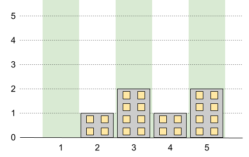

# 1840. Maximum Building Height - LeetCode Python/Java/C++/JS/C#/Go/Ruby Solutions

> [**Build Your Programmer Brand at leader.me →**](https://www.leader.me)

Visit original link: [1840. Maximum Building Height - LeetCode Python/Java/C++/JS/C#/Go/Ruby Solutions](https://www.leader.me/leetcode/en/solutions/1840-maximum-building-height) for a better experience!

LeetCode link: [1840. Maximum Building Height](https://leetcode.com/problems/maximum-building-height), difficulty: **Hard**.

## LeetCode description of "1840. Maximum Building Height"

You want to build `n` new buildings in a city. The new buildings will be built in a line and are labeled from `1` to `n`.

However, there are city restrictions on the heights of the new buildings:

* The height of each building must be a non-negative integer.
* The height of the first building **must** be `0`.
* The height difference between any two adjacent buildings **cannot exceed** `1`.

Additionally, there are city restrictions on the maximum height of specific buildings. These restrictions are given as a 2D integer array `restrictions` where `restrictions[i] = [idi, maxHeighti]` indicates that building `idi` must have a height **less than or equal to** `maxHeighti`.

It is guaranteed that each building will appear **at most once** in `restrictions`, and building `1` will **not** be in `restrictions`.

Return *the **maximum possible height** of the **tallest** building*.

### [Example 1]



**Input**: `n = 5, restrictions = [[2,1],[4,1]]`

**Output**: `2`

**Explanation**: 

<p>The green area in the image indicates the maximum allowed height for each building.<br>
We can build the buildings with heights [0,1,2,1,2], and the tallest building has a height of 2.</p>


### [Example 2]


**Input**: `n = 6, restrictions = []`

**Output**: `5`

**Explanation**: 

<p>The green area in the image indicates the maximum allowed height for each building.<br>
We can build the buildings with heights [0,1,2,3,4,5], and the tallest building has a height of 5.</p>


### [Example 3]


**Input**: `n = 10, restrictions = [[5,3],[2,5],[7,4],[10,3]]`

**Output**: `5`

**Explanation**: 

<p>The green area in the image indicates the maximum allowed height for each building.<br>
We can build the buildings with heights [0,1,2,3,3,4,4,5,4,3], and the tallest building has a height of 5.</p>


### [Constraints]

* `2 <= n <= 10^9`
* `0 <= restrictions.length <= min(n - 1, 10^5)`
* `2 <= idi <= n`
* `idi` is **unique**.
* `0 <= maxHeighti <= 10^9`

## Intuition

The problem asks us to find the maximum building height such that the absolute height difference between adjacent buildings is at most 1, subject to certain height restrictions at specific building indices. 
This means a restriction at building `A` also limits the maximum possible height at building `B` to `height[A] + |A - B|`. To find the true, tightest maximum height allowed at each restricted building, we must propagate the constraints across the entire array of restrictions. 

First, we sort the restrictions by building ID. Then we perform two passes:
1. **Left-to-Right Pass**: Propagates the constraints from the left neighbor to the right.
2. **Right-to-Left Pass**: Propagates the constraints from the right neighbor to the left.

After both passes, all restrictions are perfectly consistent with each other. The maximum possible height between any two adjacent restricted buildings `i` and `j` can then be calculated mathematically. It corresponds to the intersection of two lines with slopes +1 and -1 starting from their respective heights, given by the formula: `(height[i] + height[j] + id[j] - id[i]) / 2`.

## Step-by-Step Solution

1. **Append Implicit Restrictions**: Building 1 always has a height of 0, so we add `[1, 0]`. Building `n` has no explicit restriction, but its maximum possible height bounded by the first building is `n - 1`, so we add `[n, n - 1]` to ensure the last interval is checked.
2. **Sort**: Sort the `restrictions` array by building ID in ascending order.
3. **Left-to-Right Pass**: Iterate from the second restriction to the end. Update the current building's height limit to the minimum of its own limit and the limit imposed by the previous building (`height[i-1] + id[i] - id[i-1]`).
4. **Right-to-Left Pass**: Iterate from the second-to-last restriction down to the first. Update the current building's height limit to the minimum of its current limit and the limit imposed by the next building (`height[i+1] + id[i+1] - id[i]`).
5. **Calculate Peak Heights**: Iterate through all adjacent pairs of restrictions. For each pair `i-1` and `i`, calculate the local peak height that can be reached between them using the formula: `(height[i-1] + height[i] + id[i] - id[i-1]) / 2`.
6. Keep track of the global maximum height found across all pairs and return it.

## Complexity

> - **Time Complexity**: `O(M \log M)`, where `M` is the number of restrictions. Sorting the restrictions array dominates the time complexity. The two linear passes and the final peak calculation take `O(M)` time.
- **Space Complexity**: `O(M)` or `O(\log M)` depending on the sorting algorithm and the language's ability to sort the array in place or whether a new array is created to include the implicit restrictions.

- Time complexity: `O(M \log M)`.
- Space complexity: `O(M)`.

## Python

```python
class Solution:
    def maxBuilding(self, n: int, restrictions: List[List[int]]) -> int:
        # Add implicit restrictions for the first and last buildings
        restrictions.append([1, 0])
        restrictions.append([n, n - 1])
        
        # Sort restrictions by building ID
        restrictions.sort()
        
        m = len(restrictions)
        
        # Left-to-right pass: Propagate height limits from left to right
        for i in range(1, m):
            restrictions[i][1] = min(restrictions[i][1], restrictions[i-1][1] + restrictions[i][0] - restrictions[i-1][0])
            
        # Right-to-left pass: Propagate height limits from right to left
        for i in range(m - 2, -1, -1):
            restrictions[i][1] = min(restrictions[i][1], restrictions[i+1][1] + restrictions[i+1][0] - restrictions[i][0])
            
        ans = 0
        # Find the maximum height between each adjacent pair of restrictions
        for i in range(1, m):
            h1, h2 = restrictions[i-1][1], restrictions[i][1]
            x1, x2 = restrictions[i-1][0], restrictions[i][0]
            
            # The peak height reached between x1 and x2
            # It's derived from solving intersection: h1 + (x - x1) = h2 + (x2 - x)
            ans = max(ans, (h1 + h2 + x2 - x1) // 2)
            
        return ans
```

## Java

```java
class Solution {
    public int maxBuilding(int n, int[][] restrictions) {
        int m = restrictions.length;
        // Create a new array to include the 2 implicit restrictions
        int[][] r = new int[m + 2][2];
        for (int i = 0; i < m; i++) {
            r[i] = restrictions[i];
        }
        r[m] = new int[]{1, 0};
        r[m + 1] = new int[]{n, n - 1};
        
        // Sort the array based on building IDs
        Arrays.sort(r, (a, b) -> Integer.compare(a[0], b[0]));
        
        // Left-to-right pass
        for (int i = 1; i < r.length; i++) {
            r[i][1] = Math.min(r[i][1], r[i-1][1] + r[i][0] - r[i-1][0]);
        }
        
        // Right-to-left pass
        for (int i = r.length - 2; i >= 0; i--) {
            r[i][1] = Math.min(r[i][1], r[i+1][1] + r[i+1][0] - r[i][0]);
        }
        
        int ans = 0;
        // Calculate the maximum peak height between every adjacent restriction
        for (int i = 1; i < r.length; i++) {
            int h1 = r[i-1][1], h2 = r[i][1];
            int x1 = r[i-1][0], x2 = r[i][0];
            ans = Math.max(ans, (h1 + h2 + x2 - x1) / 2);
        }
        
        return ans;
    }
}
```

## JavaScript

```javascript
/**
 * @param {number} n
 * @param {number[][]} restrictions
 * @return {number}
 */
var maxBuilding = function(n, restrictions) {
    // Append the implicit restrictions
    restrictions.push([1, 0]);
    restrictions.push([n, n - 1]);
    
    // Sort restrictions ascending by ID
    restrictions.sort((a, b) => a[0] - b[0]);
    
    const m = restrictions.length;
    
    // Pass 1: Left to right
    for (let i = 1; i < m; i++) {
        restrictions[i][1] = Math.min(restrictions[i][1], restrictions[i-1][1] + restrictions[i][0] - restrictions[i-1][0]);
    }
    
    // Pass 2: Right to left
    for (let i = m - 2; i >= 0; i--) {
        restrictions[i][1] = Math.min(restrictions[i][1], restrictions[i+1][1] + restrictions[i+1][0] - restrictions[i][0]);
    }
    
    let ans = 0;
    // Calculate peaks between restrictions
    for (let i = 1; i < m; i++) {
        const h1 = restrictions[i-1][1];
        const h2 = restrictions[i][1];
        const x1 = restrictions[i-1][0];
        const x2 = restrictions[i][0];
        
        ans = Math.max(ans, Math.floor((h1 + h2 + x2 - x1) / 2));
    }
    
    return ans;
};
```

## Cpp

```cpp
class Solution {
public:
    int maxBuilding(int n, vector<vector<int>>& restrictions) {
        // Push implicit bounds
        restrictions.push_back({1, 0});
        restrictions.push_back({n, n - 1});
        
        // Sort based on building ID
        sort(restrictions.begin(), restrictions.end());
        
        int m = restrictions.size();
        
        // Left to right propagation
        for (int i = 1; i < m; i++) {
            restrictions[i][1] = min(restrictions[i][1], restrictions[i-1][1] + restrictions[i][0] - restrictions[i-1][0]);
        }
        
        // Right to left propagation
        for (int i = m - 2; i >= 0; i--) {
            restrictions[i][1] = min(restrictions[i][1], restrictions[i+1][1] + restrictions[i+1][0] - restrictions[i][0]);
        }
        
        int ans = 0;
        // Compute maximum peak
        for (int i = 1; i < m; i++) {
            int h1 = restrictions[i-1][1], h2 = restrictions[i][1];
            int x1 = restrictions[i-1][0], x2 = restrictions[i][0];
            ans = max(ans, (h1 + h2 + x2 - x1) / 2);
        }
        
        return ans;
    }
};
```

## Csharp

```csharp
public class Solution {
    public int MaxBuilding(int n, int[][] restrictions) {
        int m = restrictions.Length;
        int[][] r = new int[m + 2][];
        
        // Copy restrictions and add the implicit bounds
        for (int i = 0; i < m; i++) {
            r[i] = restrictions[i];
        }
        r[m] = new int[] { 1, 0 };
        r[m + 1] = new int[] { n, n - 1 };
        
        // Sort by building ID
        Array.Sort(r, (a, b) => a[0].CompareTo(b[0]));
        
        // Sweep left to right
        for (int i = 1; i < r.Length; i++) {
            r[i][1] = Math.Min(r[i][1], r[i-1][1] + r[i][0] - r[i-1][0]);
        }
        
        // Sweep right to left
        for (int i = r.Length - 2; i >= 0; i--) {
            r[i][1] = Math.Min(r[i][1], r[i+1][1] + r[i+1][0] - r[i][0]);
        }
        
        int ans = 0;
        // Evaluate the peak heights
        for (int i = 1; i < r.Length; i++) {
            int h1 = r[i-1][1], h2 = r[i][1];
            int x1 = r[i-1][0], x2 = r[i][0];
            ans = Math.Max(ans, (h1 + h2 + x2 - x1) / 2);
        }
        
        return ans;
    }
}
```

## Go

```go
import "sort"

func maxBuilding(n int, restrictions [][]int) int {
    // Append constraints for first and last building
    restrictions = append(restrictions, []int{1, 0})
    restrictions = append(restrictions, []int{n, n - 1})
    
    // Sort restrictions ascending by ID
    sort.Slice(restrictions, func(i, j int) bool {
        return restrictions[i][0] < restrictions[j][0]
    })
    
    m := len(restrictions)
    
    // Left-to-right pass
    for i := 1; i < m; i++ {
        limit := restrictions[i-1][1] + restrictions[i][0] - restrictions[i-1][0]
        if limit < restrictions[i][1] {
            restrictions[i][1] = limit
        }
    }
    
    // Right-to-left pass
    for i := m - 2; i >= 0; i-- {
        limit := restrictions[i+1][1] + restrictions[i+1][0] - restrictions[i][0]
        if limit < restrictions[i][1] {
            restrictions[i][1] = limit
        }
    }
    
    ans := 0
    // Find the max height achievable between every adjacent restrictions
    for i := 1; i < m; i++ {
        h1, h2 := restrictions[i-1][1], restrictions[i][1]
        x1, x2 := restrictions[i-1][0], restrictions[i][0]
        peak := (h1 + h2 + x2 - x1) / 2
        if peak > ans {
            ans = peak
        }
    }
    
    return ans
}
```

## Ruby

```ruby
# @param {Integer} n
# @param {Integer[][]} restrictions
# @return {Integer}
def max_building(n, restrictions)
    # Append implicit restrictions
    restrictions << [1, 0]
    restrictions << [n, n - 1]
    
    # Sort by building ID
    restrictions.sort_by! { |r| r[0] }
    
    m = restrictions.length
    
    # Left-to-right pass
    (1...m).each do |i|
        limit = restrictions[i-1][1] + restrictions[i][0] - restrictions[i-1][0]
        restrictions[i][1] = [restrictions[i][1], limit].min
    end
    
    # Right-to-left pass
    (m - 2).downto(0) do |i|
        limit = restrictions[i+1][1] + restrictions[i+1][0] - restrictions[i][0]
        restrictions[i][1] = [restrictions[i][1], limit].min
    end
    
    ans = 0
    # Calculate peaks
    (1...m).each do |i|
        h1, h2 = restrictions[i-1][1], restrictions[i][1]
        x1, x2 = restrictions[i-1][0], restrictions[i][0]
        
        ans = [ans, (h1 + h2 + x2 - x1) / 2].max
    end
    
    ans
end
```

## Rust

```rust
impl Solution {
    pub fn max_building(n: i32, mut restrictions: Vec<Vec<i32>>) -> i32 {
        // Add boundary building constraints
        restrictions.push(vec![1, 0]);
        restrictions.push(vec![n, n - 1]);
        
        // Sort restrictions based on ID
        restrictions.sort_unstable_by_key(|r| r[0]);
        
        let m = restrictions.len();
        
        // Left-to-right propagation
        for i in 1..m {
            let limit = restrictions[i-1][1] + restrictions[i][0] - restrictions[i-1][0];
            restrictions[i][1] = restrictions[i][1].min(limit);
        }
        
        // Right-to-left propagation
        for i in (0..m - 1).rev() {
            let limit = restrictions[i+1][1] + restrictions[i+1][0] - restrictions[i][0];
            restrictions[i][1] = restrictions[i][1].min(limit);
        }
        
        let mut ans = 0;
        // Compute peak height between every adjacent pairs
        for i in 1..m {
            let h1 = restrictions[i-1][1];
            let h2 = restrictions[i][1];
            let x1 = restrictions[i-1][0];
            let x2 = restrictions[i][0];
            
            ans = ans.max((h1 + h2 + x2 - x1) / 2);
        }
        
        ans
    }
}
```

## Kotlin

```kotlin
class Solution {
    fun maxBuilding(n: Int, restrictions: Array<IntArray>): Int {
        val r = Array(restrictions.size + 2) { IntArray(2) }
        
        for (i in restrictions.indices) {
            r[i] = restrictions[i]
        }
        r[restrictions.size] = intArrayOf(1, 0)
        r[restrictions.size + 1] = intArrayOf(n, n - 1)
        
        r.sortBy { it[0] }
        
        for (i in 1 until r.size) {
            r[i][1] = Math.min(r[i][1], r[i-1][1] + r[i][0] - r[i-1][0])
        }
        
        for (i in r.size - 2 downTo 0) {
            r[i][1] = Math.min(r[i][1], r[i+1][1] + r[i+1][0] - r[i][0])
        }
        
        var ans = 0
        for (i in 1 until r.size) {
            val h1 = r[i-1][1]
            val h2 = r[i][1]
            val x1 = r[i-1][0]
            val x2 = r[i][0]
            ans = Math.max(ans, (h1 + h2 + x2 - x1) / 2)
        }
        
        return ans
    }
}
```

## Swift

```swift
class Solution {
    func maxBuilding(_ n: Int, _ restrictions: [[Int]]) -> Int {
        var r = restrictions
        // Add boundary conditions
        r.append([1, 0])
        r.append([n, n - 1])
        
        r.sort { $0[0] < $1[0] }
        
        let m = r.count
        
        // Pass 1: sweep left to right
        for i in 1..<m {
            r[i][1] = min(r[i][1], r[i-1][1] + r[i][0] - r[i-1][0])
        }
        
        // Pass 2: sweep right to left
        for i in stride(from: m - 2, through: 0, by: -1) {
            r[i][1] = min(r[i][1], r[i+1][1] + r[i+1][0] - r[i][0])
        }
        
        var ans = 0
        // Find the global maximum height across all gaps
        for i in 1..<m {
            let h1 = r[i-1][1]
            let h2 = r[i][1]
            let x1 = r[i-1][0]
            let x2 = r[i][0]
            
            ans = max(ans, (h1 + h2 + x2 - x1) / 2)
        }
        
        return ans
    }
}
```

## Other languages

```java
// Welcome to create a PR to complete the code of this language, thanks!
```

> 🚀 **Level Up Your Developer Identity**
>
> While mastering algorithms is key, showcasing your talent is what gets you hired.
>
> We recommend [**leader.me**](https://www.leader.me) — the ultimate all-in-one personal branding platform for programmers.
>
> **The All-In-One Career Powerhouse:**
> - 📄 **Resume, Portfolio & Blog:** Integrate your skills, GitHub projects, and writing into one stunning site.
> - 🌐 **Free Custom Domain:** Bind your own personal domain for free—forever.
> - ✨ **Premium Subdomains:** Stand out with elite tech handle like `name.leader.me`.
>
> [**Build Your Programmer Brand at leader.me →**](https://www.leader.me)

---

Visit original link: [1840. Maximum Building Height - LeetCode Python/Java/C++/JS/C#/Go/Ruby Solutions](https://www.leader.me/leetcode/en/solutions/1840-maximum-building-height) for a better experience!

GitHub repository: [leetcode-python-java](https://github.com/leetcode-python-java/leetcode-python-java).

