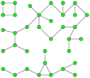

# LeetCode 1971. Find if Path Exists in Graph's Solution (Breadth-First Search)
LeetCode problem link: [1971. Find if Path Exists in Graph](https://leetcode.com/problems/find-if-path-exists-in-graph)

## LeetCode problem description
There is a **bi-directional** graph with `n` vertices, where each vertex is labeled from `0` to `n - 1` (**inclusive**). The edges in the graph are represented as a 2D integer array `edges`, where each `edges[i] = [ui, vi]` denotes a bi-directional edge between vertex `ui` and vertex `vi`. Every vertex pair is connected by **at most one** edge, and no vertex has an edge to itself.

You want to determine if there is a **valid path** that exists from vertex `source` to vertex `destination`.

Given `edges` and the integers `n`, `source`, and `destination`, return `true` _if there is a **valid path** from `source` to `destination`, or `false` otherwise_.

### Example 1

```
Input: n = 3, edges = [[0,1],[1,2],[2,0]], source = 0, destination = 2
Output: true
Explanation: There are two paths from vertex 0 to vertex 2:
- 0 → 1 → 2
- 0 → 2
```

### Example 2

```
Input: n = 6, edges = [[0,1],[0,2],[3,5],[5,4],[4,3]], source = 0, destination = 5
Output: false
Explanation: There is no path from vertex 0 to vertex 5.
```

### Constraints
- `1 <= n <= 2 * 10**5`
- `0 <= edges.length <= 2 * 10**5`
- `edges[i].length == 2`
- `0 <= ui, vi <= n - 1`
- `ui != vi`
- `0 <= source, destination <= n - 1`
- There are no duplicate edges.
- There are no self edges.

## Another solution: UnionFind Algorithm
Please see [1971. Find if Path Exists in Graph (UnionFind Solution)](1971-find-if-path-exists-in-graph-2.md).

## Intuition
This graph may have multiple **connected components**. 



Initially, we start from `source` vertex which belongs to one of the `connected components`.
We need to find if there is a path from `source` to `destination`. This question is equivalent to determine if `source` and `destination` vertices belong to the same `connected component`.

### Breadth-First Search
* There are two major ways to explore a `connected component`: **Breadth-First Search** and **Depth-First Search**.
* For **Depth-First Search**, there are two ways to make it: `Recursive` and `Iterative`. Please see [200. Number of Islands (Depth-First Search)](../1-1000/200-number-of-islands.md).


* As shown in the figure above, **breadth-first search** can be thought of as visiting vertices in rounds and rounds.

* `breadth-first search` emphasizes first-in-first-out, so a **queue** is needed.

## Approach (Breadth-First Search)
1. Starting at the `source` vertex, find all the vertices of the `connected component` by `breadth-first search`.
1. In order to conduct `breadth-first search`, we need to know the adjacent vertices of a vertex. So we need a `map` `vertex_to_adjacent_vertices`. We can initialize the `map` by transforming `edges`.
1. We need to mark all vertices on the same connected component as vertex `source` as `visited` because visited vertices don't need to be visited again.
1. Once vertex `destination` is encountered, return `true`.

## Complexity
* Time: `O(n)`.
* Space: `O(n)`.

## Python
```python
class Solution:
    def validPath(self, n: int, edges: List[List[int]], source: int, destination: int) -> bool:
        vertex_queue = deque([source])
        visited_vertices = set([source])

        vertex_to_adjacent_vertices = defaultdict(list)
        for vertex0, vertex1 in edges:
            vertex_to_adjacent_vertices[vertex0].append(vertex1)
            vertex_to_adjacent_vertices[vertex1].append(vertex0)

        while vertex_queue:
            vertex = vertex_queue.popleft()

            if vertex == destination:
                return True

            for adjacent_vertex in vertex_to_adjacent_vertices[vertex]:
                if adjacent_vertex not in visited_vertices:
                    vertex_queue.append(adjacent_vertex)
                    visited_vertices.add(adjacent_vertex) # Mark visited as soon as `vertex_queue.append(adjacent_vertex)`. Otherwise it may have performance issue!

        return False
```

## Java
```java
// Welcome to create a PR to complete the code of this language, thanks!
```

## C++
```cpp
// Welcome to create a PR to complete the code of this language, thanks!
```

## JavaScript
```javascript
// Welcome to create a PR to complete the code of this language, thanks!
```

## C#
```c#
// Welcome to create a PR to complete the code of this language, thanks!
```

## Go
```go
// Welcome to create a PR to complete the code of this language, thanks!
```

## Ruby
```ruby
# Welcome to create a PR to complete the code of this language, thanks!
```

## C
```c
// Welcome to create a PR to complete the code of this language, thanks!
```

## Kotlin
```kotlin
// Welcome to create a PR to complete the code of this language, thanks!
```

## Swift
```swift
// Welcome to create a PR to complete the code of this language, thanks!
```

## Rust
```rust
// Welcome to create a PR to complete the code of this language, thanks!
```

## Other languages
```
// Welcome to create a PR to complete the code of this language, thanks!
```
