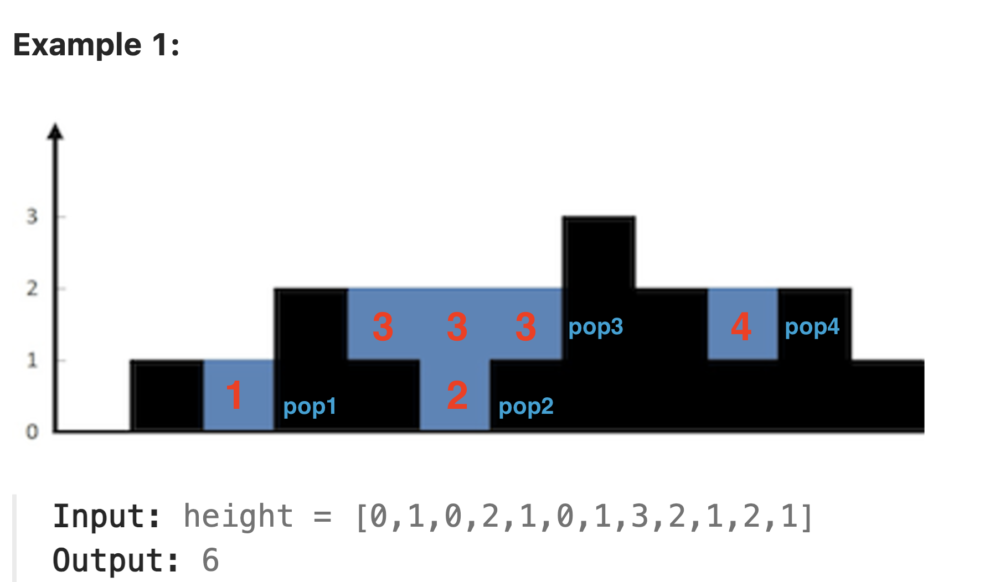

# 42. Trapping Rain Water (Monotonic Stack Solution)
LeetCode problem link: [42. Trapping Rain Water](https://leetcode.com/problems/trapping-rain-water/)

## LeetCode problem description
Given `n` non-negative integers representing an elevation map where the width of each bar is `1`, compute how much water it can trap after raining.

### Example 1

```
Input: height = [0,1,0,2,1,0,1,3,2,1,2,1]
Output: 6

Explanation: The above elevation map (black section) is represented by array [0,1,0,2,1,0,1,3,2,1,2,1].
In this case, 6 units of rain water (blue section) are being trapped.
```

### Example 2
```
Input: height = [4,2,0,3,2,5]
Output: 9
```

### Constraints
- `n == height.length`
- `1 <= n <= 2 * 10000`
- `0 <= height[i] <= 100000`

## Thoughts
This problem can be solved using **Monotonic Stack**.

### Solution 1
#### Rules
* Whenever there are area (rain) can be added, add it immediately.
* The shorter side's height will be used to calculate the area.
* There would be **two situations**:
    1) The right side (current item) is **no shorter** than the left side (the top of stack).
    2) The right side (current item) is **shorter** than the left side (the top of stack).



Detailed solutions will be given later, and now only the best practices in 7 languages are given.

### Solution 2
The `solution 2` will follow **Monotonic Stack**'s common rule: **only calculating when `pop()` is happening**.

Please click [42. Trapping Rain Water (solution 2)](./0042-trapping-rain-water-2.md) to see it.

### Complexity
* Time: `O(n)`.
* Space: `O(n)`.

## Java
```java
class Solution {
    public int trap(int[] heights) {
        var result = 0;
        var indexStack = new Stack<Integer>();

        for (var i = 0; i < heights.length; i++) {
            var previousHeight = 0;

            while (!indexStack.empty() && heights[indexStack.peek()] <= heights[i]) { // situation 1: right side (i) is no shorter
                var leftIndex = indexStack.pop();
                var heightGap = heights[leftIndex] - previousHeight;
                var width = i - leftIndex - 1;
                result += heightGap * width;
                previousHeight = heights[leftIndex];
            }

            if (!indexStack.empty()) { // situation 2: right side (i) is shorter
                var heightGap = heights[i] - previousHeight;
                var width = i - indexStack.peek() - 1;
                result += heightGap * width;
            }

            indexStack.push(i);
        }

        return result;
    }
}
```

## Python
```python
class Solution:
    def trap(self, heights: List[int]) -> int:
        result = 0
        index_stack = []

        for i, height in enumerate(heights):
            previous_height = 0

            while index_stack and heights[index_stack[-1]] <= height: # situation 1: right side (i) is no shorter
                left_index = index_stack.pop()
                height_gap = heights[left_index] - previous_height
                width = i - left_index - 1
                result += height_gap * width
                previous_height = heights[left_index]

            if index_stack: # situation 2: right side (i) is shorter
                height_gap = height - previous_height
                width = i - index_stack[-1] - 1
                result += height_gap * width

            index_stack.append(i)

        return result
```


## C++
```cpp
class Solution {
public:
    int trap(vector<int>& heights) {
        auto result = 0;
        stack<int> index_stack;

        for (auto i = 0; i < heights.size(); i++) {
            auto previous_height = 0;

            while (!index_stack.empty() && heights[index_stack.top()] <= heights[i]) { // situation 1: right side (i) is no shorter
                auto left_index = index_stack.top();
                index_stack.pop();
                auto height_gap = heights[left_index] - previous_height;
                auto width = i - left_index - 1;
                result += height_gap * width;
                previous_height = heights[left_index];
            }

            if (!index_stack.empty()) { // situation 2: right side (i) is shorter
                auto height_gap = heights[i] - previous_height;
                auto width = i - index_stack.top() - 1;
                result += height_gap * width;
            }

            index_stack.push(i);
        }

        return result;
    }
};
```

## JavaScript
```javascript
var trap = function (heights) {
  let result = 0
  const indexStack = []

  heights.forEach((height, i) => {
    let previousHeight = 0

    while (indexStack.length > 0 && heights[indexStack.at(-1)] <= height) { // situation 1: right side (i) is no shorter
      const leftIndex = indexStack.pop()
      const heightGap = heights[leftIndex] - previousHeight
      const width = i - leftIndex - 1
      result += heightGap * width
      previousHeight = heights[leftIndex]
    }

    if (indexStack.length > 0) { // situation 2: right side (i) is shorter
      const heightGap = height - previousHeight
      const width = i - indexStack.at(-1) - 1
      result += heightGap * width
    }

    indexStack.push(i)
  })

  return result
};
```


## C#
```c#
public class Solution
{
    public int Trap(int[] heights)
    {
        int result = 0;
        var indexStack = new Stack<int>();

        for (var i = 0; i < heights.Length; i++)
        {
            int previousHeight = 0;

            // situation 1: right side (i) is no shorter
            while (indexStack.Count > 0 && heights[indexStack.Peek()] <= heights[i])
            {
                int leftIndex = indexStack.Pop();
                int heightGap = heights[leftIndex] - previousHeight;
                int width = i - leftIndex - 1;
                result += heightGap * width;
                previousHeight = heights[leftIndex];
            }

            // situation 2: right side (i) is shorter
            if (indexStack.Count > 0)
            {
                int heightGap = heights[i] - previousHeight;
                int width = i - indexStack.Peek() - 1;
                result += heightGap * width;
            }

            indexStack.Push(i);
        }

        return result;
    }
}
```

## Go
```go
func trap(heights []int) int {
    result := 0
    indexStack := []int{}

    for i, height := range heights {
        previousHeight := 0

        for len(indexStack) > 0 && heights[indexStack[len(indexStack) - 1]] <= height { // situation 1: right side (i) is no shorter
            leftIndex := indexStack[len(indexStack) - 1]
            heightGap := heights[leftIndex] - previousHeight
            width := i - leftIndex - 1
            result += heightGap * width
            previousHeight = heights[leftIndex]
            indexStack = indexStack[:len(indexStack) - 1]
        }

        if len(indexStack) > 0 { // situation 2: right side (i) is shorter
            heightGap := height - previousHeight
            width := i - indexStack[len(indexStack) - 1] - 1
            result += heightGap * width
        }

        indexStack = append(indexStack, i)
    }

    return result
}
```


## Ruby
```ruby
# Original article at https://github.com/gazeldx/leetcode-best-practice
def trap(heights = [])
  result = 0
  index_stack = []

  heights.each_with_index do |height, i|
    previous_height = 0

    while !index_stack.empty? && heights[index_stack[-1]] <= height # situation 1: right side (i) is no shorter
      left_index = index_stack.pop
      height_gap = heights[left_index] - previous_height
      width = i - left_index - 1
      result += height_gap * width
      previous_height = heights[left_index]
    end

    if !index_stack.empty? # situation 2: right side (i) is shorter
      height_gap = height - previous_height
      width = i - index_stack[-1] - 1
      result += height_gap * width
    end

    index_stack << i
  end

  result
end
```

## Rust
```rust
// Welcome to create a PR to complete the code of this language, thanks!
```

## Other languages
```
// Welcome to create a PR to complete the code of this language, thanks!
```
