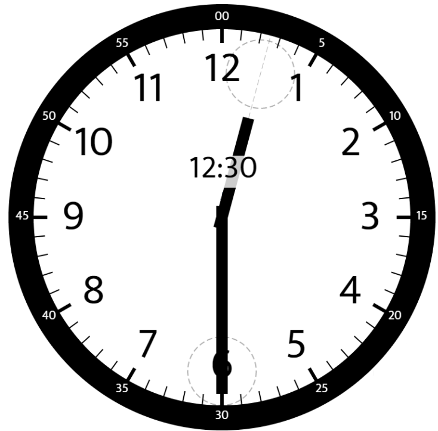
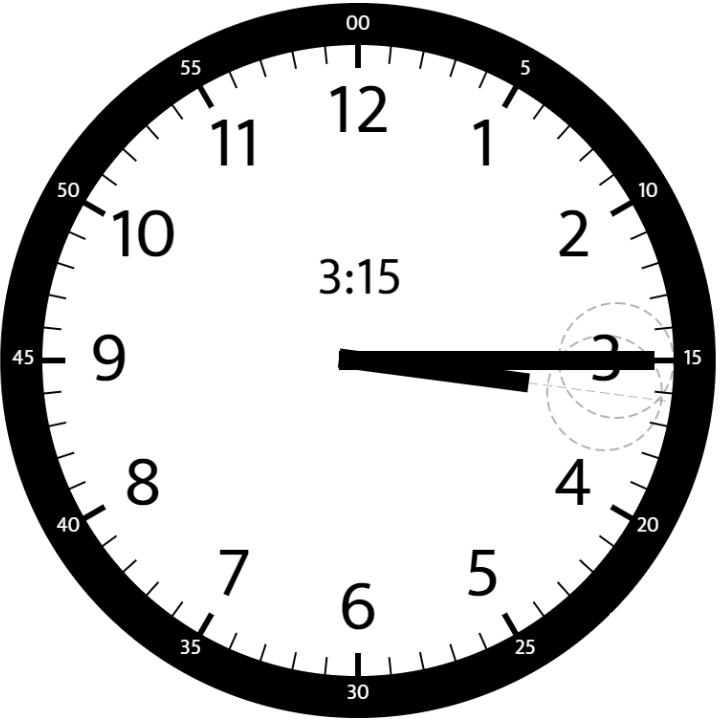

# 1344. 时钟指针的夹角 - LeetCode Python/Java/C++/JS/C#/Go/Ruby 题解

> [**前往 leader.me 打造你的开发者个人IP →**](https://www.leader.me)

访问原文链接：[1344. 时钟指针的夹角 - LeetCode Python/Java/C++/JS/C#/Go/Ruby 题解](https://www.leader.me/leetcode/zh/solutions/1344-angle-between-hands-of-a-clock)，体验更佳！

力扣链接：[1344. 时钟指针的夹角](https://leetcode.cn/problems/angle-between-hands-of-a-clock), 难度等级：**中等**。

## LeetCode “1344. 时钟指针的夹角”问题描述

给你两个数 `hour` 和 `minutes` 。请你返回在时钟上，由给定时间的时针和分针组成的较小角的角度（60 单位制）。

请注意，返回的结果误差在 `10^-5` 以内都会被视为正确。

### [示例 1]



**输入**: `hour = 12, minutes = 30`

**输出**: `165`

### [示例 2]


**输入**: `hour = 3, minutes = 30`

**输出**: `75`

### [示例 3]



**输入**: `hour = 3, minutes = 15`

**输出**: `7.5`

### [约束]

- `1 <= hour <= 12`
- `0 <= minutes <= 59`

### [Hints]

<details>
  <summary>提示 1</summary>
  The tricky part is determining how the minute hand affects the position of the hour hand.

  
</details>

<details>
  <summary>提示 2</summary>
  Calculate the angles separately then find the difference.

  
</details>

## 思路

要求出时针和分针之间的夹角，我们可以分别计算两根指针相对于 12 点钟位置（0 度）的角度，然后求这两个角度的绝对差值。

首先，我们来看**分针**：
整个表盘是 360 度，一共 60 分钟。因此，分针每分钟走 `360 / 60 = 6` 度。
所以，分针的角度就是 `minutes * 6`。

接下来，我们考虑**时针**：
整个表盘是 360 度，一共 12 个小时。因此，时针每小时走 `360 / 12 = 30` 度。
但是，当时针在走的时候，它并不是一动不动的！在 60 分钟内，时针会走 30 度，这意味着时针每分钟走 `30 / 60 = 0.5` 度。
所以，时针的角度是 `(hour % 12) * 30 + minutes * 0.5`。（我们使用 `hour % 12` 是因为 12 点钟与 0 点钟的起始位置是相同的）。

最后，我们计算这两个角度的绝对差值：`diff = abs(hour_angle - minute_angle)`。

因为题目要求返回**较小**的夹角，而两根指针会将表盘分成两个角度，它们的和是 360 度。所以我们返回 `diff` 和 `360 - diff` 中的较小值即可。

## 步骤

1. 计算分针的角度：`minute_angle = minutes * 6.0`。
2. 计算时针的角度：`hour_angle = (hour % 12) * 30.0 + minutes * 0.5`。
3. 计算两者的绝对差值：`diff = abs(hour_angle - minute_angle)`。
4. 返回较小的角度：`min(diff, 360.0 - diff)`。

## 复杂度

> - **时间复杂度：** `O(1)`，因为我们只进行了几次基本的算术运算。
- **空间复杂度：** `O(1)`，我们只使用了几个变量来存储角度信息。

- 时间复杂度: `O(1)`.
- 空间复杂度: `O(1)`.

## Python

```python
class Solution:
    def angleClock(self, hour: int, minutes: int) -> float:
        # Calculate the angle of the minute hand
        minute_angle = minutes * 6
        
        # Calculate the angle of the hour hand
        hour_angle = (hour % 12) * 30 + minutes * 0.5
        
        # Find the absolute difference between the two angles
        diff = abs(hour_angle - minute_angle)
        
        # Return the smaller angle
        return min(diff, 360 - diff)
```

## Java

```java
class Solution {
    public double angleClock(int hour, int minutes) {
        // Calculate the angle of the minute hand
        double minuteAngle = minutes * 6.0;
        
        // Calculate the angle of the hour hand
        double hourAngle = (hour % 12) * 30.0 + minutes * 0.5;
        
        // Find the absolute difference between the two angles
        double diff = Math.abs(hourAngle - minuteAngle);
        
        // Return the smaller angle
        return Math.min(diff, 360.0 - diff);
    }
}
```

## JavaScript

```javascript
/**
 * @param {number} hour
 * @param {number} minutes
 * @return {number}
 */
var angleClock = function(hour, minutes) {
    // Calculate the angle of the minute hand
    const minuteAngle = minutes * 6;
    
    // Calculate the angle of the hour hand
    const hourAngle = (hour % 12) * 30 + minutes * 0.5;
    
    // Find the absolute difference between the two angles
    const diff = Math.abs(hourAngle - minuteAngle);
    
    // Return the smaller angle
    return Math.min(diff, 360 - diff);
};
```

## C++

```cpp
class Solution {
public:
    double angleClock(int hour, int minutes) {
        // Calculate the angle of the minute hand
        double minute_angle = minutes * 6.0;
        
        // Calculate the angle of the hour hand
        double hour_angle = (hour % 12) * 30.0 + minutes * 0.5;
        
        // Find the absolute difference between the two angles
        double diff = abs(hour_angle - minute_angle);
        
        // Return the smaller angle
        return min(diff, 360.0 - diff);
    }
};
```

## C#

```csharp
public class Solution {
    public double AngleClock(int hour, int minutes) {
        // Calculate the angle of the minute hand
        double minuteAngle = minutes * 6.0;
        
        // Calculate the angle of the hour hand
        double hourAngle = (hour % 12) * 30.0 + minutes * 0.5;
        
        // Find the absolute difference between the two angles
        double diff = Math.Abs(hourAngle - minuteAngle);
        
        // Return the smaller angle
        return Math.Min(diff, 360.0 - diff);
    }
}
```

## Go

```go
import "math"

func angleClock(hour int, minutes int) float64 {
    // Calculate the angle of the minute hand
    minuteAngle := float64(minutes) * 6.0
    
    // Calculate the angle of the hour hand
    hourAngle := float64(hour % 12) * 30.0 + float64(minutes) * 0.5
    
    // Find the absolute difference between the two angles
    diff := math.Abs(hourAngle - minuteAngle)
    
    // Return the smaller angle
    return math.Min(diff, 360.0 - diff)
}
```

## Ruby

```ruby
# @param {Integer} hour
# @param {Integer} minutes
# @return {Float}
def angle_clock(hour, minutes)
    # Calculate the angle of the minute hand
    minute_angle = minutes * 6.0
    
    # Calculate the angle of the hour hand
    hour_angle = (hour % 12) * 30.0 + minutes * 0.5
    
    # Find the absolute difference between the two angles
    diff = (hour_angle - minute_angle).abs
    
    # Return the smaller angle
    [diff, 360.0 - diff].min
end
```

## Rust

```rust
impl Solution {
    pub fn angle_clock(hour: i32, minutes: i32) -> f64 {
        // Calculate the angle of the minute hand
        let minute_angle = (minutes as f64) * 6.0;
        
        // Calculate the angle of the hour hand
        let hour_angle = ((hour % 12) as f64) * 30.0 + (minutes as f64) * 0.5;
        
        // Find the absolute difference between the two angles
        let diff = (hour_angle - minute_angle).abs();
        
        // Return the smaller angle
        diff.min(360.0 - diff)
    }
}
```

## Kotlin

```kotlin
import kotlin.math.*

class Solution {
    fun angleClock(hour: Int, minutes: Int): Double {
        // Calculate the angle of the minute hand
        val minuteAngle = minutes * 6.0
        
        // Calculate the angle of the hour hand
        val hourAngle = (hour % 12) * 30.0 + minutes * 0.5
        
        // Find the absolute difference between the two angles
        val diff = abs(hourAngle - minuteAngle)
        
        // Return the smaller angle
        return min(diff, 360.0 - diff)
    }
}
```

## Swift

```swift
class Solution {
    func angleClock(_ hour: Int, _ minutes: Int) -> Double {
        // Calculate the angle of the minute hand
        let minuteAngle = Double(minutes) * 6.0
        
        // Calculate the angle of the hour hand
        let hourAngle = Double(hour % 12) * 30.0 + Double(minutes) * 0.5
        
        // Find the absolute difference between the two angles
        let diff = abs(hourAngle - minuteAngle)
        
        // Return the smaller angle
        return min(diff, 360.0 - diff)
    }
}
```

## Other languages

```java
// Welcome to create a PR to complete the code of this language, thanks!
```

> 🚀 **打造你的开发者个人IP**
>
> 掌握算法是成功的基石，而全方位展示你的才华则是获得垂青的关键。
>
> 我的另一个项目 [**leader.me**](https://www.leader.me) —— 专为程序员打造的“全能型”个人品牌展示平台。
>
> **三位一体（All-In-One）的职场利器：**
> - 📄 **简历 + 作品集 + 博客：** 将你的 GitHub 项目、技术心得与职场经历完美融合。
> - 🌐 **永久免费自定义域名：** 支持绑定你自己的独立域名，且该功能永久免费。
> - ✨ **顶级行业子域名：** 提供 `name.leader.me`，极具职业含金量的专属域名。

>
> [**立即前往 leader.me 打造你的个人品牌 →**](https://www.leader.me)

---

访问原文链接：[1344. 时钟指针的夹角 - LeetCode Python/Java/C++/JS/C#/Go/Ruby 题解](https://www.leader.me/leetcode/zh/solutions/1344-angle-between-hands-of-a-clock)，体验更佳！

GitHub 仓库: [leetcode-python-java](https://github.com/leetcode-python-java/leetcode-python-java).

